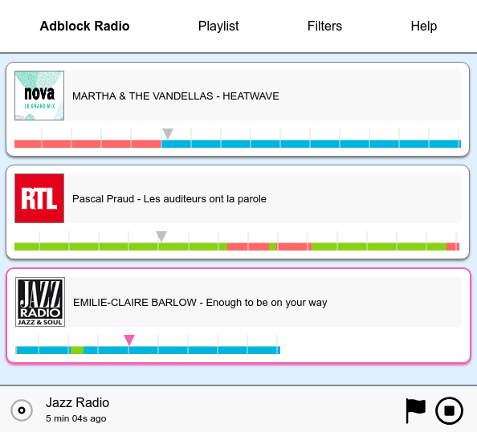

# Adblock Radio Buffer
Listen to the radio ad-free and without interruptions.
Adblock Radio Buffer buffers radio content and lets you fast-forward ads.

Uses [Adblock Radio](https://github.com/adblockradio/adblockradio) as a backend, featuring machine-learning and acoustic fingerprinting techniques.

[A technical discussion describes how it works](https://www.adblockradio.com/blog/2018/11/15/designing-audio-ad-block-radio-podcast/).

## Preview



### Player interface

For each radio, metadata is retrieved with the [open source live metadata scraper](https://github.com/adblockradio/webradio-metadata).

A colored bar indicates how much of audio is available. Default setting is to buffer up to 15 minutes.
Each color tells the user about the content of the audio:
- blue for music
- green for talk
- red for ads

### Select the content you want to hear

You can choose what kind of content you want to hear or skip on each radio.

On news stations, it is great just to skip ads.
On musical stations, it's convenient to skip ads and also talk interruptions.

### Many radios available, more to come

At the time of writing, 68 radios are available in the player.

It is planned to add more. You can [submit requests here](https://github.com/adblockradio/available-models/).

### Crowd-sourced improvements of the filters

Sometimes the predictor is wrong. Not a problem, it is possible to report mispredictions.

It makes Adblock Radio better for everybody.

## Installation

### Binary (Linux only, alpha quality)
An Electron Linux binary is available [here](http://cdn.s00.adblockradio.com/ABR-Buffer-v1.0.tar.gz).
It has been tested on Debian 8.0/LMDE2 x64.
It needs `ffmpeg` on your system. If you do not have it, run `sudo apt install ffmpeg`.

Windows and Mac builds are expected in the future.

### From source
Installation instructions expect a minimum of technical knowledge.

Create an empty directory somewhere on your machine, we call it `DIR`.

First, install [Adblock Radio algorithm](https://github.com/adblockradio/adblockradio). You should now have `DIR/adblockradio` with the files inside. In that subdirectory, run `node demo.js` to check everything is working correctly.

Then, install this player. This has been tested with `node` version 10.9.0 and `npm` version 6.4.1. Run these commands in `DIR`, so that `DIR/adblockradio-buffer` will be created:
```
git clone https://github.com/adblockradio/adblockradio-buffer.git
cd adblockradio-buffer
npm install
cd client
npm install
npm run build
cd ..
```

#### Interface in browser
```
npm run start
```
Open `http://localhost:9820` in your favorite browser.
Add your radios and enjoy!

#### Interface in Electron (native desktop app)
```
cd node_modules/adblockradio
npm rebuild zeromq --runtime=electron --target=3.0.9 --update-binary
cd ../..
npm run electron
```
Add your radios and enjoy!


### Development

In a first terminal, open React dev server:
```
cd client
npm start
```

#### Interface in browser
In another terminal, run the backend:
```
npm run startdev
```
Open `http://localhost:9820` in your favorite browser.

#### Interface in Electron (native desktop app)
In another terminal, run the backend:
```
npm run electrondev
```

## Roadmap

- Nicer UI and UX (help would be appreciated)
- Cross platform Electron builds
- Docker builds (WIP)
- Cordova apps (WIP), or even better React native apps

Contributions welcome.

## Copyright

Copyright 2018, [Alexandre Storelli](https://github.com/dest4)
